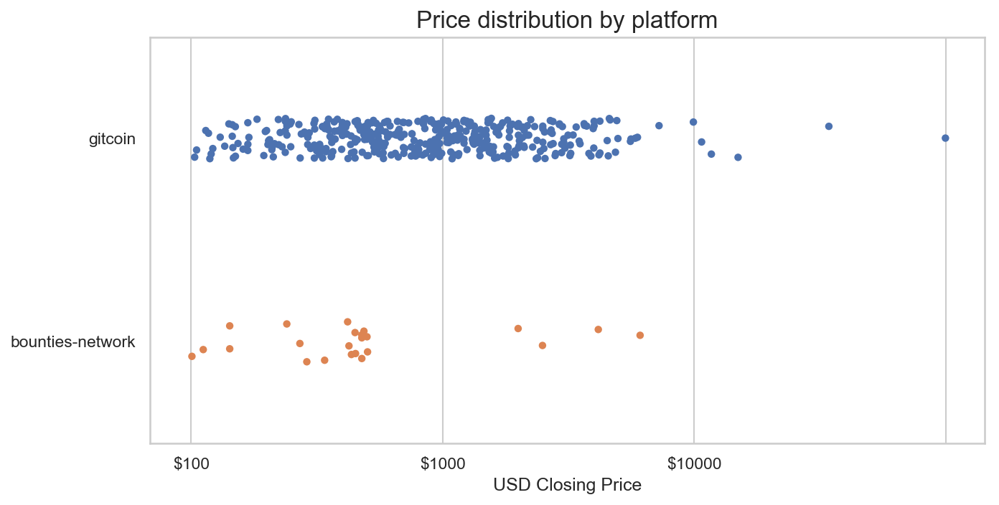
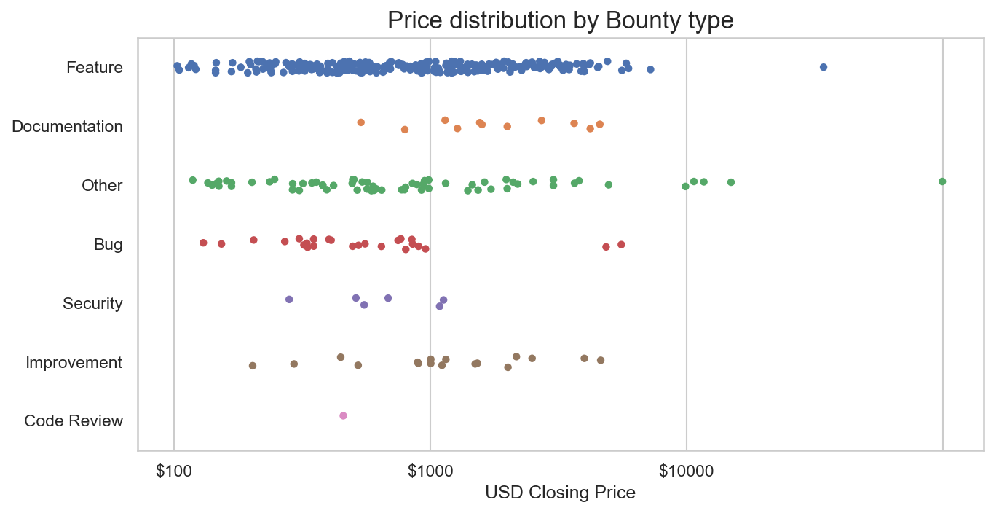
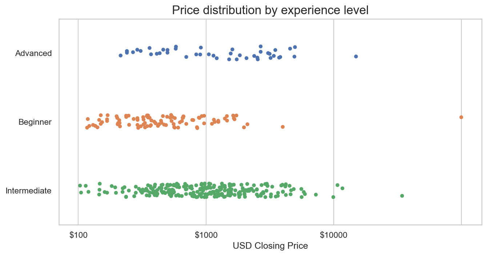

# Predicting bounty price based on issue text

## Abstract

The goal of this work is to predict a bounty's closing price based on the textual content of the bounty. The main hypothesis is that an issue's text is able to predict its price. As it turns out, this is only partially true, and there are some features (token type, description length, and categories) that explain some of the variance in the pricing. These hint at a number of areas which may be very useful in the future to help curate a great market.

## Methods

All data analyzed was collected from a `pg_dump` of the bounties API database that was taken on August 30 2018.

The training pipeline is a standard who's who of NLP techniques. First, all the URLs, non alpha-numeric characters and repeated space are all stripped out. Then, `nltk` is used for stopwrd removal. At that point, `gensim` is used to train word2vec and doc2vec modesl of titles, descriptions and categories. Word2vec and doc2vec are two state-of-the-art to convert a string of text (i.e. a document) into a dimensionality reduced array. Although the arrays themselves are not meanignful to humans, their similarity is. For example, after training a word2vec model on a large corpus of english words, you would find that the vector for the word "king" minus the vector for the word "man" would result in a vector very close to "queen". Word2vec works a word at a time, while doc2vec is a modified algorithm that works on the entire text, and is aware of sentences and paragraphs.

For this pipeline, we use vectors of 350 for word2vec and doc2vec encoding of the description, and 100 for word2vec encoding of the titles and categories. Using these feature vectors, it's possible to enocde similarity of different categories (e.g. TypeScript and JavaScript may be similar, because they're often written about together). Additionally, I make the assumption that token types, difficulty level and platform are predictive of bounty price. This also assumes that certain platforms will have particular markets and properties, and sets us up well for a future expansion. For example, if there were a platform for design work, its unique vocab and market dynamics would be captured by these features.

Once the features are all encoded, it's a fairly straightforward matter of putting them into Scikit learn, and finding how well they perform. Here, the question of distance metric is an import one. I chose "mean square error", which is the average of the squared difference between a prediction and it's true (i.e. closing) price. There's more about this down below.

1. Load all bounties from `pg_dump` of `bounties` database, derived from `contract_subscriber`.
2. Filter un-closed and small bounties (< 10$ currently)
3. Feature generation: bounty description text cleaning

  - Strip stopwords using `nltk`s English stopwords file
  - Replace non-alnum characters and URLs
  - Strip all repeated spacing characters (but retaining `\` and `\n`)
  - Convert all letters to lowercase

4. Feature generation for titles and descriptions

  - Convert all characters to lowercase
  - Strip all leading and trailing and repeated spaces

5. One-hot encode other categorical variables (bounty type, difficulty level, token type, bounty platform)

6. Compute days to deadline, replacing null deadlines with 0

7. Compute doc2vec model for description, word2vec model for description, title and categories. Compute description length in words.

8. Create matrix, split for training/testing 80%/20%

9. Grid search and optimal model selection. Compared:

  - Gradient Boosted Trees (`XGBoost`)
  - Random Forests (`sklearn`)
  - Linear regression (`sklearn`)
  - Lasso regression (`sklearn`)
  - Ridge regression (`sklearn`)
  - Elastic Net regression (`sklearn`)

## Results

The TLDR is that the best MSE was 156,791\. Over the approximately 350 bounties that closed with a closing price greater than 10$, that would be a typical misprediction in the neighborhood of 150$.

### Feature engineering

The best performance (minimum MSE) was found when as many features are possible were included in the training data. I conducted a manual grid search for all the different combinations of word2vec and doc2vec on the descriptions, titles, categories, difficulty levels, deadlines, and token types. More was found to be better. Anecdotally, the length of the description and the token type both explained a lot of the price variability.

### Model performance

Elastic net regression did the best. Ensemble based approaches (XGBoost and Random forests) didn't do as well. Ne-aural networks weren't tried, but I'm guessing they won't work too well if the other ensemble methods didn't work well. However, text based neural networks is a big kettle of fish for another time.

Model type                                                                           | Best MSE
------------------------------------------------------------------------------------ | ---------
XGBoost, 35 estimators, alpha 0.1 , lambda 0.95, max depth 5, lr 0.05, subsample 0.1 | 275517.77
Random forest, 400 estimators                                                        | 25016.25
Linear regression, defaults                                                          | 137812.74
Ridge regression (alpha = 10.00)                                                     | 29095.24
Lasso regression (alpha = 29.93)                                                     | 17590.36
Elastic Net (alpha = 2.25)                                                           | 15941.21

### Market properties

Overall there's large variability between markets. The majority of closed bounties have been on gitcoin. Interestingly, there doesn't seem to be too much difference between different skill levels or feature types.

Across all platforms, there were 435 closed bounties. The average deadline is 19 days (standard deviation of 68 days). The average price is $159 with a standard deviation of 521$, 158$ was the 75th percentile, and the largest bounty was 9997$.

The `gitcoin` platform contained 412 closed bounties, while on the `bounties-network` platform, there were 23 closed bounties. The average closing price was 163$ and 23$ respectively (with standard deviations of 534$ and 146$ respectively).

### Figures

#### Platform price distribution



#### Issue type price distribution



#### Experience level price distribution



#### Bounty category price distribution

[It's a big figure](data/category_price_dist.png)

## Discussion

The big finding from this research seems to be that there isn't a big difference between bounty type, difficulty or category, and there aren't many bounties. Our not so hot performance is probably due to data insufficiency more than anything else.

### Short and Long descriptions appear to result in expensive bounties

In certain iterations of model evaluation, I've noticed that short and long bounty texts can produce erratic predictions. Also, missing data due to schema evolution can be problematic. It may be wise to enforce at the API level some data quality filtering rules. An example of one that has been problematic with gradient boosted trees, but seems to have simmered down a lot with regularized regressions:

```python
Python 3.6.5 (default, Apr 25 2018, 14:23:58)
Type 'copyright', 'credits' or 'license' for more information
IPython 6.5.0 -- An enhanced Interactive Python. Type '?' for help.

In [1]: import pricepredictor, datetime

In [2]: pp = pricepredictor.PricePredictor()
[nltk_data] Downloading package stopwords to /Users/mike/nltk_data...
[nltk_data]   Package stopwords is already up-to-date!

In [3]: pp.predict(title="Reddit /r/bounties bot",description="The /r/bounties subreddit is looking awfully empty… we should fill it. Build a service which listens for events from the StandardBounties contract, and
   ...:  posts newly activated bounties to the subreddit. The description of the post should have all of the relevant details (pulled from IPFS), including any relevant links to files which were included. To see so
   ...: me sample code about how this is currently implemented in the Bounties Network Explorer, take a look at https://github.com/ConsenSys/BountiesFactory/blob/master/src/components/BountyPage/BountyPage.js. The
   ...: bot should also comment on the reddit post in question every time a new action is made, including updates to the bounty (ie extended deadline, increased payout), along with any submissions (again, using the
   ...:  submitted hash to pull the relevant submission).", categories=["Code", "javascript", "nodejs"], experience_level=None, deadline=datetime.datetime(2018,12,11), token_type='ETH', bounty_type=None, platform='
   ...: bounties-network' )
Out[3]: array([ 169.62307171])
```

### Data insufficiency is a challenge

Overall, I just don't think there's enough data for a good fit. For example, the Bounties Network only has 23 closed bounties. On gitcoin it's a bit bigger, but still there's a lot of variability between bounties. The biggest sign of trouble I see is that there's not a big distinction between

### Tokens explain a lot of the price variability, since we fit on USD

I would guess that a lot of noise (and therefore, bad predictions) are really just artifacts of an unstable token/USD exchange. If there are few bounties, not many people use them yet as a primary source of income, and the exchange rate between tokens and USD fluctuates, people may be thinking of bounties as "side money" and are not sensitive to the final closing price. One improvement here would be to predict prices in ETH. However, a good prediction needs a common denominator. Alternatively produce models for each coin (though having "token type" in the features helps a lot). Another option is to produce multiple predictions (in all tokens, instead of just USD)

### MSE is probably not the best error metric

Here, I used MSE for fitting the models and evaluating their performance. The "mean squared error" is hard to interpret for any individual prediction. There are other options but it would need some thought to use them correctly.

### A less fun statistical approach is better for the platform now

I believe in the short term a statistical approach that works on percentile is probably the best choice. Would suggest slicing by category (if big enough) and log-normalized-and-binned days to deadline. An example input would be "Javascipt, 30 days" and a distribution of closing prices would be presented to the user. For example a user would input their bounty and would be shown that the 50th percentile is 150$ and 90th percentile is 450$. This would allow users to price their own bounties using their own intuition. This is a less exciting solution but may be the right choice for the market in the short term.

## Future research

There's a lot more that could be done if this line of inquiry is to be expanded. Here are just a few areas that can be built upon. Many large online marketplaces (e.g. Airbnb, EBay, Amazon) use these techniques to great success to run stable, efficient and profitable markets. The methods used here are built on papers produced by these companies working to solve exactly these problems.

1. RNN/CNN on text
2. More rigorous grid search
3. Just... rerun everything here with more data. It's state of the art NLP.
4. Language detection, although only needed when someone posts a non-English bounty
5. Design platform protocol to collect more machine-friendly data. E.g.: enforce a more strict category system, encode features like programming language, frameworks or toolkits.
6. Better error metrics compared to MSE.
7. Look into who's submitting bounties, consider this more than not at all.
