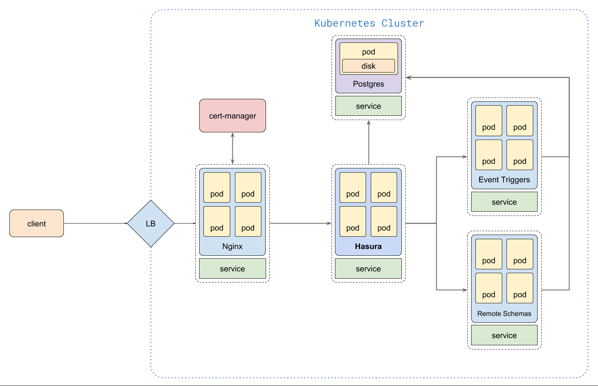

# hasura-k8s-stack

A feature-complete Hasura stack on Kubernetes.

## Components

- Postgres _(For production use cases, it is recommended to have a managed/highly available Postgres instance)_
- Hasura GraphQL Engine
- Nginx for Ingress
- Cert Manager for auto SSL with Let's Encrypt
- Remote Schema with Express.js and GraphQL.js
- Event Triggers with Express.js

## Architecture



## Setting up

_This guide is written with the assumption that the user is well versed with
Kubernetes and the user has a Kubernetes cluster with enough resources ready for
consumption._

### Hasura GraphQL Engine

[Hasura GraphQL Engine](https://hasura.io) is deployed as a Kubernetes
Deployment along with a Service object to load balance traffic to multiple pods.
The default deployment launches one instance of GraphQL Engine connected to the
Postgres DB provisioned earlier.

#### Installation

```bash
cd hasura

vim secret.yaml

# create the secret
kubectl apply -f secret.prod.yaml -n ${NAMESPACE}

# create the deployment and service
kubectl apply -f deployment-service.yaml -n ${NAMESPACE}

vim ingress.yaml

# create the ingress and alb, ssl and route53 if ALB Controller and ExternalDNS setup in AWS EKS
kubectl apply -f deployment-service.yaml -n ${NAMESPACE}
```

Hasura should be available as `http://hasura:80` inside the cluster.

#### Scaling

Hasura can be horizontally scaled without any side-effects. Just increase the
number of replicas for the Kubernetes deployment. Make sure that there is enough
CPU/RAM available for the new replicas.

```bash
kubectl scale deployment/hasura --replicas 3
```

#### Migrations

Hasura can keep track of the database and metadata changes and store them as
declarative files so that it can be version controlled. It is a flexible system
that let's you write migrations by hand or it can auto-generate migrations when
you use the console.

To use migrations, install the Hasura CLI - instructions are in the
[docs](https://docs.hasura.io/1.0/graphql/manual/hasura-cli/install-hasura-cli.html).

Once CLI is installed, open the console using CLI.

```bash
cd hasura

# open console
hasura console --endpoint <hasura-endpoint> --access-key <hasura-access-key>
```

As and when you use the console to make changes, CLI will write migration files
(yaml) to the `migrations` directory.

[Read more](https://docs.hasura.io/1.0/graphql/manual/migrations/index.html)
about migrations.

The same migrations can then be applied on another Hasura instance:

```bash
cd hasura

# apply migrations on another instance
hasura migrate apply --endpoint <another-hasura-endpoint> --access-key <access-key>
```

```bash
# get load balancer ip
kubectl -n rinkebystaging get ingress

NAME            TYPE           CLUSTER-IP     EXTERNAL-IP    PORT(S)                      AGE
ingress-nginx   LoadBalancer   10.0.162.204   52.172.9.111   80:31186/TCP,443:30609/TCP   30h

# copy the EXTERNAL-IP
```

Once you have the `EXTERNAL-IP` from the output above, add an A record for your
domain from the DNS dashboard.

We'll use the same domain in our ingress configuration.

You can check the status by checking if the address is assigned. Once it is
available you can go to the domain and it should load the Hasura console.

## TODO

- Setting up CI/CD scripts for migrations and environment promotion.
